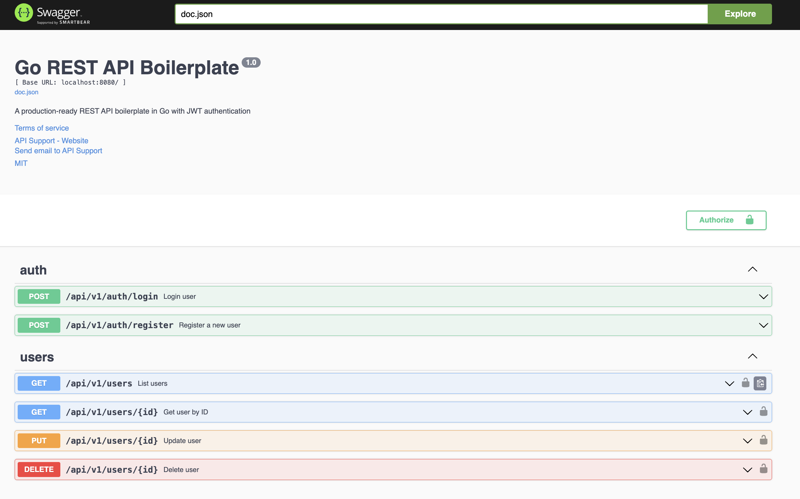

# 📚 Swagger Documentation Guide

Complete guide for generating and using Swagger/OpenAPI documentation.

## 🎨 Swagger UI Preview

<div align="center">

</div>

Interactive API documentation with "Try it out" feature available at `http://localhost:8080/swagger/index.html`

## 🎯 Quick Start

### Option 1: Docker (Automatic - Recommended)

**Swagger docs are automatically generated during Docker build!** No manual steps needed when using Docker.

```bash
# Just start the containers - swagger docs are generated automatically
docker-compose up --build
```

### Option 2: Using Make (For Native Development)

```bash
make swag
```

### Option 3: Using Script Directly

```bash
./scripts/init-swagger.sh
```

### Option 4: Manual

```bash
# Install swag CLI (first time only)
go install github.com/swaggo/swag/cmd/swag@latest

# Generate docs
swag init -g ./cmd/server/main.go -o ./api/docs
```

## 📍 When to Generate Swagger Docs

### ✅ Docker Development (Automatic)

**Swagger docs are automatically generated during Docker build!** The Dockerfile includes `RUN make swag` which generates the docs as part of the build process.

```bash
# Just start containers - docs are generated automatically
docker-compose up --build
```

**Benefits:**
- No manual steps required
- Docs are always up-to-date
- Consistent across environments
- Works out of the box

### ✅ Native Development (Manual)

**Only needed when running the application directly on your host machine:**

```bash
# Generate swagger docs for native development
make swag
```

**When to use:**
- Running `go run cmd/server/main.go` directly
- Building binary with `go build`
- Not using Docker containers

## 🛠️ Setup (For Native Development Only)

**Note**: If you're using Docker, Swagger docs are generated automatically. You only need this setup for native development.

### 1. Install Swag CLI

```bash
go install github.com/swaggo/swag/cmd/swag@latest
```

### 2. Add to PATH (if needed)

If you get "swag: command not found":

**macOS/Linux:**
```bash
# Add to ~/.bashrc or ~/.zshrc
export PATH="$PATH:$HOME/go/bin"

# Then reload
source ~/.bashrc  # or source ~/.zshrc
```

**Windows (PowerShell):**
```powershell
# Add to PATH
$env:Path += ";$env:USERPROFILE\go\bin"
```

### 3. Verify Installation

```bash
swag --version
```

Should output: `swag version v1.x.x`

## 📝 How It Works

### 1. Swagger Annotations

API endpoints are annotated in code with swagger comments:

```go
// @Summary Register a new user
// @Description Register a new user with name, email and password
// @Tags auth
// @Accept json
// @Produce json
// @Param request body RegisterRequest true "Registration request"
// @Success 200 {object} AuthResponse
// @Failure 400 {object} map[string]string
// @Router /api/v1/auth/register [post]
func (h *Handler) Register(c *gin.Context) {
    // Handler code...
}
```

### 2. Generation Process

When you run `make swag`, it:
1. Scans your Go code for swagger annotations
2. Generates three files in `api/docs/`:
   - `docs.go` - Go code
   - `swagger.json` - JSON spec
   - `swagger.yaml` - YAML spec

### 3. Access Swagger UI

Start the server and visit:
```
http://localhost:8080/swagger/index.html
```

## 📂 Generated Files

After running `make swag`:

```
api/docs/
├── docs.go          # Generated Go code (DO NOT EDIT)
├── swagger.json     # OpenAPI 3.0 spec in JSON
└── swagger.yaml     # OpenAPI 3.0 spec in YAML
```

**Note**: These files are in `.gitignore` because they're generated.

## 🔄 When to Regenerate

Regenerate swagger docs when you:
- ✅ Add new API endpoints
- ✅ Modify existing endpoint signatures
- ✅ Change request/response structures
- ✅ Update API documentation
- ✅ Change route paths or methods

## 📋 Common Swagger Annotations

### Endpoint Documentation

```go
// @Summary      Short description
// @Description  Detailed description
// @Tags         tag-name
// @Accept       json
// @Produce      json
// @Param        name query string false "Description"
// @Success      200 {object} ResponseType
// @Failure      400 {object} ErrorType
// @Router       /api/v1/path [method]
```

### Authentication

```go
// @Security BearerAuth
```

### Request Body

```go
// @Param request body RequestDTO true "Request description"
```

### Query Parameters

```go
// @Param page query int false "Page number" default(1)
// @Param size query int false "Page size" default(10)
```

### Path Parameters

```go
// @Param id path int true "User ID"
```

## 🎨 Main API Documentation

In `cmd/server/main.go`:

```go
// @title           Go REST API Boilerplate
// @version         1.0
// @description     A production-ready REST API boilerplate in Go
// @termsOfService  http://swagger.io/terms/

// @contact.name   API Support
// @contact.email  support@example.com

// @license.name  MIT
// @license.url   https://opensource.org/licenses/MIT

// @host      localhost:8080
// @BasePath  /

// @securityDefinitions.apikey BearerAuth
// @in header
// @name Authorization
```

## 🐛 Troubleshooting

### Issue: "swag: command not found"

**Solution 1**: Install swag
```bash
go install github.com/swaggo/swag/cmd/swag@latest
```

**Solution 2**: Add to PATH
```bash
export PATH="$PATH:$HOME/go/bin"
```

**Solution 3**: Use full path
```bash
$HOME/go/bin/swag init -g ./cmd/server/main.go -o ./api/docs
```

### Issue: "Cannot find package docs"

**Problem**: Server can't find generated swagger docs.

**Solution**: 
- **If using Docker**: Docs are generated automatically during build
- **If running natively**: Make sure you've run `make swag` before starting the server

### Issue: "Failed to load API definition" / "Internal Server Error doc.json"

**Problem**: Swagger UI loads but shows error fetching doc.json.

**Symptoms**:
- Swagger UI page appears but shows "Failed to load API definition"
- Browser console shows: "Internal Server Error doc.json"
- Files exist in `api/docs/` but aren't served

**Solution**: The swagger docs package must be imported in `cmd/server/main.go`:

```go
import (
    _ "github.com/vahiiiid/go-rest-api-boilerplate/api/docs" // swagger docs
    // ... other imports
)
```

**Why?**
- The blank import `_` runs the `init()` function in docs package
- This registers the swagger spec with swag library
- Without it, Gin's swagger handler can't find the API definition

**Steps to fix**:
1. Ensure `api/docs/docs.go` exists (run `make swag` if missing)
2. Add the blank import to `cmd/server/main.go`
3. Rebuild: `docker-compose up --build`
4. Access: http://localhost:8080/swagger/index.html

### Issue: Swagger UI shows old data

**Solution**: 
- **If using Docker**: Rebuild containers to regenerate docs
  ```bash
  docker-compose up --build
  ```
- **If running natively**: Regenerate docs and restart server
  ```bash
  make swag
  # Then restart your server
  ```

### Issue: "Failed to parse annotations"

**Solution**: Check your swagger comments syntax. Common mistakes:
- Missing spaces after `@`
- Wrong tag names
- Invalid type references
- Missing required fields

## 📚 Advanced Usage

### Custom Types

Define DTOs with swagger annotations:

```go
type UserResponse struct {
    ID    uint   `json:"id" example:"1"`
    Name  string `json:"name" example:"John Doe"`
    Email string `json:"email" example:"john@example.com"`
}
```

### Multiple Tags

```go
// @Tags users, admin
```

### Response Examples

```go
// @Success 200 {object} UserResponse "User found"
// @Success 200 {array} UserResponse "Users list"
```

### Multiple Responses

```go
// @Success 200 {object} SuccessResponse
// @Success 201 {object} CreatedResponse
// @Failure 400 {object} ErrorResponse
// @Failure 404 {object} NotFoundResponse
// @Failure 500 {object} ServerErrorResponse
```

## 🔗 Integration with CI/CD

### GitHub Actions

```yaml
- name: Generate Swagger docs
  run: |
    go install github.com/swaggo/swag/cmd/swag@latest
    swag init -g ./cmd/server/main.go -o ./api/docs
    
- name: Check for changes
  run: |
    git diff --exit-code api/docs/ || \
    (echo "Swagger docs not up to date. Run: make swag" && exit 1)
```

### Pre-commit Hook

Create `.git/hooks/pre-commit`:

```bash
#!/bin/bash
make swag
git add api/docs/
```

## 📖 Resources

- [Swaggo Documentation](https://github.com/swaggo/swag)
- [Swagger/OpenAPI Spec](https://swagger.io/specification/)
- [Gin-Swagger Integration](https://github.com/swaggo/gin-swagger)

## 💡 Best Practices

✅ **Do:**
- Regenerate docs after changing API
- Keep annotations up to date
- Use meaningful descriptions
- Provide example values
- Document all error cases

❌ **Don't:**
- Manually edit generated files
- Commit with outdated docs
- Skip documenting new endpoints
- Use vague descriptions

## 🎯 Quick Reference

```bash
# Generate docs
make swag

# Install swag
go install github.com/swaggo/swag/cmd/swag@latest

# Verify swag
swag --version

# Format swagger comments
swag fmt

# View docs
open http://localhost:8080/swagger/index.html
```

---

**Happy Documenting!** 📚

