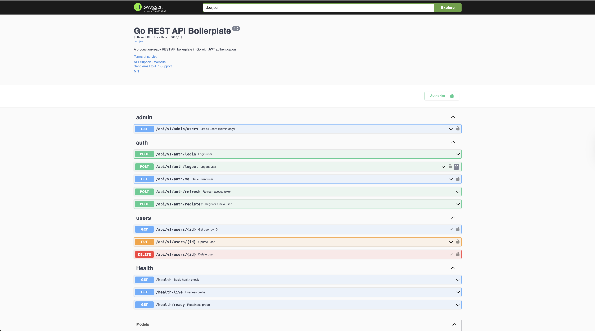

<div align="center">


<h2><strong>G</strong>o <strong>R</strong>EST <strong>A</strong>PI <strong>B</strong>oilerplate</h2>

<p><em>Grab it and Go &mdash; a clean, production-ready REST API starter kit in Go with JWT, PostgreSQL, Docker, and Swagger.</em></p>

<p>


</p>

<p>
<a href="https://github.com/vahiiiid/go-rest-api-boilerplate">🚀 Main Repository</a> | 
<a href="https://vahiiiid.github.io/go-rest-api-docs/">📖 Documentation</a> | 
<a href="https://github.com/vahiiiid/go-rest-api-boilerplate/releases/tag/v1.0.0">📋 Changelog</a> | 
<a href="https://github.com/vahiiiid/go-rest-api-boilerplate/issues">🐛 Report Issues</a>
</p>

</div>

---

## ✨ Features

<div class="grid cards" markdown>

- :material-shield-check: **JWT Authentication**
  
    Secure token-based authentication with HS256 algorithm

- :material-account-group: **User Management**
  
    Complete CRUD operations with validation

- :material-database: **PostgreSQL + GORM**
  
    Robust database with powerful ORM

- :material-docker: **Docker Development**
  
    Hot-reload with Air (~2 sec feedback)

- :material-rocket-launch: **Production Ready**
  
    Optimized multi-stage Docker builds

- :material-api: **Swagger/OpenAPI**
  
    Interactive API documentation

- :material-database-sync: **Database Migrations**
  
    Version-controlled schema changes

- :material-test-tube: **Automated Testing**
  
    Unit & integration tests

- :material-github: **GitHub Actions CI**
  
    Automated linting and testing

- :material-console: **Make Commands**
  
    Simplified workflow automation

- :material-script-text: **Helper Scripts**
  
    Quick setup and verification tools

- :material-postage-stamp: **Postman Collection**
  
    Pre-configured API tests

- :material-layers: **Clean Architecture**
  
    Layered, maintainable structure

- :material-security: **Security Best Practices**
  
    Bcrypt hashing, input validation

- :material-web: **CORS Support**
  
    Configurable cross-origin requests

</div>

---

## 🚀 Quick Start

Get up and running in **under 2 minutes**:

### Prerequisites

- [Docker](https://docs.docker.com/get-docker/) and [Docker Compose](https://docs.docker.com/compose/install/)
- [Git](https://git-scm.com/downloads)

### One-Command Setup ⚡

```bash
git clone https://github.com/vahiiiid/go-rest-api-boilerplate.git
cd go-rest-api-boilerplate
make quick-start
```

**🎉 Done!** Your API is now running at:

- **API Base URL:** http://localhost:8080/api/v1
- **Swagger UI:** http://localhost:8080/swagger/index.html
- **Health Check:** http://localhost:8080/health

### What Just Happened?

The `quick-start` command automatically:

1. ✅ Installed development tools (swag, golangci-lint, migrate, air)
2. ✅ Verified all prerequisites and dependencies
3. ✅ Created `.env` file from template
4. ✅ Generated Swagger documentation
5. ✅ Built and started Docker containers
6. ✅ Ran database migrations (via AutoMigrate)

### Try It Out 🧪

```bash
# Check health
curl http://localhost:8080/health

# Register a user
curl -X POST http://localhost:8080/api/v1/auth/register \
  -H "Content-Type: application/json" \
  -d '{
    "name": "Alice Smith",
    "email": "alice@example.com",
    "password": "secret123"
  }'

# Visit Swagger UI for interactive docs
open http://localhost:8080/swagger/index.html
```

---

## 📖 What's Next?

<div class="grid cards" markdown>

- :material-book-open-page-variant: **[Setup Guide](SETUP.md)**
  
    Detailed installation and configuration instructions

- :material-code-braces: **[Development Guide](DEVELOPMENT_GUIDE.md)**
  
    Learn how to build your own features

- :material-checkbox-marked-circle: **[TODO List Example](TODO_EXAMPLE.md)**
  
    Complete step-by-step tutorial with working code

- :material-docker: **[Docker Guide](DOCKER.md)**
  
    Container setup, hot-reload, and production deployment

- :material-api: **[Swagger Guide](SWAGGER.md)**
  
    API documentation generation and usage

- :material-flash: **[Quick Reference](QUICK_REFERENCE.md)**
  
    Command cheat sheet and common tasks

- :material-sitemap: **[Project Summary](PROJECT_SUMMARY.md)**
  
    Architecture overview and design patterns

</div>

---

## 🏗️ Architecture

GRAB follows **clean architecture** principles with clear separation of concerns:

```
┌─────────────────────────────────────┐
│         Handler Layer               │  ← HTTP handlers, request/response
│   (internal/user/handler.go)        │     validation, error handling
└─────────────────────────────────────┘
              ↓
┌─────────────────────────────────────┐
│         Service Layer               │  ← Business logic, orchestration
│   (internal/user/service.go)        │     transactions, domain rules
└─────────────────────────────────────┘
              ↓
┌─────────────────────────────────────┐
│       Repository Layer              │  ← Data access, CRUD operations
│  (internal/user/repository.go)      │     database queries
└─────────────────────────────────────┘
              ↓
┌─────────────────────────────────────┐
│         Database (PostgreSQL)       │  ← Data persistence
└─────────────────────────────────────┘
```

### Key Principles

- ✅ **Separation of Concerns** - Each layer has a single responsibility
- ✅ **Dependency Injection** - Loose coupling between layers
- ✅ **Testability** - Easy to mock and test each layer
- ✅ **Maintainability** - Clear structure, easy to navigate
- ✅ **Scalability** - Easy to extend with new features

---

## 💻 Development Workflow

```bash
# Start containers with hot-reload
make docker-up

# Edit code in your IDE
# Changes auto-reload in ~2 seconds! ✨

# Check code quality
make lint

# Run tests
make test

# Generate/update Swagger docs
make swag

# Stop containers
make docker-down
```

---

## 📚 API Endpoints

### Swagger UI

Interactive API documentation with "Try it out" feature:

<div align="center">

</div>

Visit `http://localhost:8080/swagger/index.html` to explore and test all endpoints directly from your browser!

### Authentication

| Method | Endpoint | Description |
|--------|----------|-------------|
| POST | `/api/v1/auth/register` | Register new user |
| POST | `/api/v1/auth/login` | Login user |

### Users (Protected)

| Method | Endpoint | Description | Auth Required |
|--------|----------|-------------|---------------|
| GET | `/api/v1/users` | List users (paginated) | ✅ |
| GET | `/api/v1/users/:id` | Get user by ID | ✅ |
| PUT | `/api/v1/users/:id` | Update user | ✅ |
| DELETE | `/api/v1/users/:id` | Delete user | ✅ |

### Health

| Method | Endpoint | Description |
|--------|----------|-------------|
| GET | `/health` | Health check |

### Postman Collection

Pre-configured Postman collection with all endpoints and tests:

<div align="center">

</div>

Import `api/postman_collection.json` to get started with automated testing!

---

## 🔐 Security Features

- **Password Hashing** - Bcrypt with configurable cost (default: 10)
- **JWT Tokens** - Secure token generation and validation (HS256)
- **Input Validation** - Request validation using Gin binding tags
- **SQL Injection Protection** - GORM parameterized queries
- **CORS** - Configurable cross-origin resource sharing
- **Environment Variables** - Sensitive data never hardcoded

!!! warning "Production Checklist"
    - Change `JWT_SECRET` to a strong, random value
    - Use strong database passwords
    - Enable HTTPS/TLS
    - Configure proper CORS origins
    - Set up rate limiting
    - Enable database connection encryption
    - Regular dependency updates

---

## 🤝 Contributing

Contributions are welcome! Please read our [contributing guidelines](https://github.com/vahiiiid/go-rest-api-boilerplate/blob/main/CONTRIBUTING.md) before submitting pull requests.

### Quick Guidelines

1. Fork the repository
2. Create a feature branch
3. Make your changes
4. Run tests and linter
5. Commit your changes
6. Push to the branch
7. Open a Pull Request

---

## 📄 License

This project is licensed under the MIT License - see the [LICENSE](https://github.com/vahiiiid/go-rest-api-boilerplate/blob/main/LICENSE) file for details.

---

## 🙏 Acknowledgments

Built with these amazing tools:

- [Gin](https://github.com/gin-gonic/gin) - HTTP web framework
- [GORM](https://gorm.io/) - ORM library
- [golang-jwt](https://github.com/golang-jwt/jwt) - JWT implementation
- [swaggo](https://github.com/swaggo/swag) - Swagger documentation
- [Air](https://github.com/air-verse/air) - Hot-reload for development
- [golang-migrate](https://github.com/golang-migrate/migrate) - Database migrations

---

<div align="center">

<p><strong>Made with ❤️ for the Go community</strong></p>

<p><a href="https://github.com/vahiiiid/go-rest-api-boilerplate">⭐ Star this repo</a> if you find it useful!</p>

</div>
